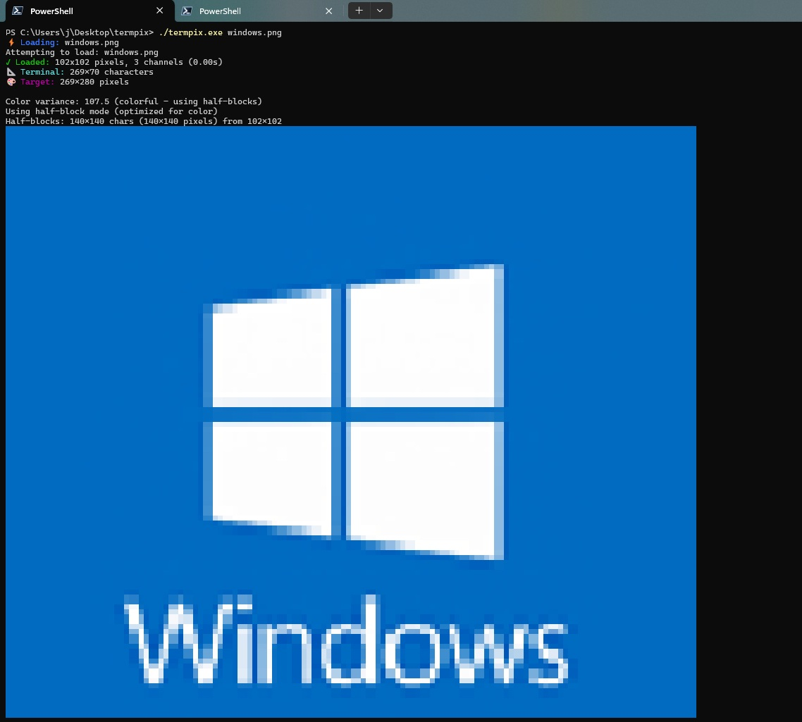

# TermPix

**TermPix** is a high-resolution terminal image renderer built in C. It transforms images into rich, colorful terminal graphics using half-block and braille rendering modes with automatic optimization based on image content.

> **Note**: This is a fork of the original [TermPix by Kelsi Davis](https://github.com/Kelsidavis/TermPix) with added Nix flake support for reproducible builds and development environments.

---

## Features

* ✅ Smart mode detection: auto-selects best rendering (photo vs. diagram)
* 🎨 Half-block color rendering (2× vertical resolution)
* 🔍 Braille detail rendering (4× resolution for line work)
* 🖼️ Dithering support with Floyd–Steinberg algorithm
* 🧱 Terminal-aware sizing with aspect ratio preservation
* 🔇 Silent mode for clean output (perfect for piping and automation)
* 💻 Cross-platform: Fully compatible with Windows (PowerShell/cmd) and Unix terminals

---

## Screenshot (Windows Terminal Example)

> Running `termpix.exe windows.png` on PowerShell:



---

## Usage

### Basic

```powershell
termpix image.jpg
```

TermPix auto-detects terminal size and rendering mode.

### Command-Line Options

| Option         | Description                                                       |
| -------------- | ----------------------------------------------------------------- |
| `--width N`    | Set maximum output width in characters                            |
| `--height N`   | Set maximum output height in characters                           |
| `--mode MODE`  | Set rendering mode: `auto`, `color`, or `detail`                  |
| `--dither`     | Enable dithering for smoother gradients                           |
| `--fit`        | Force exact dimension scaling (disable aspect ratio preservation) |
| `--silent`     | Suppress all status messages (output image only)                  |
| `--version`    | Show version and feature information                              |
| `--help`, `-h` | Show usage instructions                                           |

---

## Silent Mode

The `--silent` flag suppresses all status output, banner messages, and performance statistics, leaving only the rendered image. This is perfect for:

- **Piping output to files**: `termpix --silent image.jpg > output.txt`
- **Shell scripts and automation**: Clean output without progress indicators
- **Integration with other tools**: Use TermPix as part of a pipeline

### Silent Mode Examples

```bash
# Save rendered image to a file
termpix --silent vacation.jpg > vacation_ascii.txt

# Use in a script without status messages
termpix --silent --mode color photo.png

# Pipe to other commands
termpix --silent diagram.png | less

# Batch processing
for img in *.jpg; do
    termpix --silent "$img" > "${img%.jpg}_ascii.txt"
done
```

---

## PowerShell Module

TermPix can also be used as an installable PowerShell module:

### Module Layout

```
TermPix/
├── TermPix.psm1
├── TermPix.psd1
├── termpix.exe
└── screenshot.jpg
```

### Example PowerShell Function

```powershell
Show-TermPixImage -Path "image.jpg" -Width 100 -Mode color -Dither
```

### Installation

```powershell
# Manual installation
$dest = "$HOME\Documents\PowerShell\Modules\TermPix"
New-Item -ItemType Directory -Path $dest -Force | Out-Null
Copy-Item -Recurse -Path .\* -Destination $dest
Import-Module TermPix
```

---

## Build Instructions

### Windows (PowerShell + TDM-GCC / MinGW-w64)

```powershell
./build_windows.ps1
```

Requires `stb_image.h` in the `lib/` directory.

### Linux / macOS

```bash
gcc -o termpix main.c render.c terminal.c image.c -lm
```

---

## 🐧 Nix Flake Support

This fork includes full Nix flake support for reproducible builds and development environments.

### Quick Start

```bash
# Run directly without installing
nix run github:Kelsidavis/TermPix -- image.jpg

# Install to your profile (permanent installation)
nix profile install github:Kelsidavis/TermPix

# Build the package
nix build github:Kelsidavis/TermPix

# Enter development shell with all tools
nix develop github:Kelsidavis/TermPix
```

### Local Development

```bash
# Clone the repository
git clone https://github.com/Kelsidavis/TermPix
cd TermPix

# Enter development environment
nix develop

# Build and run
make
./termpix screenshot.jpg
```

The development shell includes:
- ✅ GCC compiler and build tools
- ✅ GDB debugger
- ✅ Static analysis (cppcheck)
- ✅ Code formatting (clang-format)
- ✅ Cross-compilation for Windows
- ✅ Documentation tools (doxygen)

---

## Examples

```powershell
# Basic usage
termpix photo.jpg

# High-quality color mode with dithering
termpix --mode color --dither portrait.png

# Detail mode for diagrams and line art
termpix --mode detail flowchart.tga

# Custom dimensions with forced fit
termpix --width 100 --height 40 --fit diagram.bmp

# Silent mode for file output
termpix --silent image.jpg > ascii_art.txt

# Silent mode with custom settings
termpix --silent --width 80 --mode color sunset.png > output.txt
```

---

## Rendering Modes

### Auto Mode (Default)
TermPix analyzes the image's color variance to automatically choose between color and detail modes:
- **Color images** (photos, artwork) → Half-block mode for rich colors
- **Monochrome images** (diagrams, text) → Braille mode for sharp detail

### Color Mode
Uses Unicode half-block characters (▀) with foreground and background colors:
- **2× vertical resolution** compared to normal text
- **Perfect for photographs** and colorful artwork
- Rich 24-bit color support

### Detail Mode  
Uses Unicode braille characters for maximum detail:
- **4× resolution** (2×2 dots per character)
- **Ideal for line art**, diagrams, and text
- Sharp, crisp edges with high contrast

---

## Pro Tips

- Use `--dither` with photos for smoother color transitions
- Try `--mode detail` for text, diagrams, and line art  
- Use `--silent` for clean output when piping to files or using in scripts
- Adjust terminal font size for optimal viewing experience
- Larger `--width` values show more detail, smaller ones give overview
- Combine with shell pipes: `termpix --silent image.jpg | less`

---

## Author

**Kelsi Davis**  
🌐 [https://geekastro.dev](https://geekastro.dev)

TermPix is part of a suite of tools focused on accessible software for data visualization and astrophotography workflows.

---

## License

MIT License